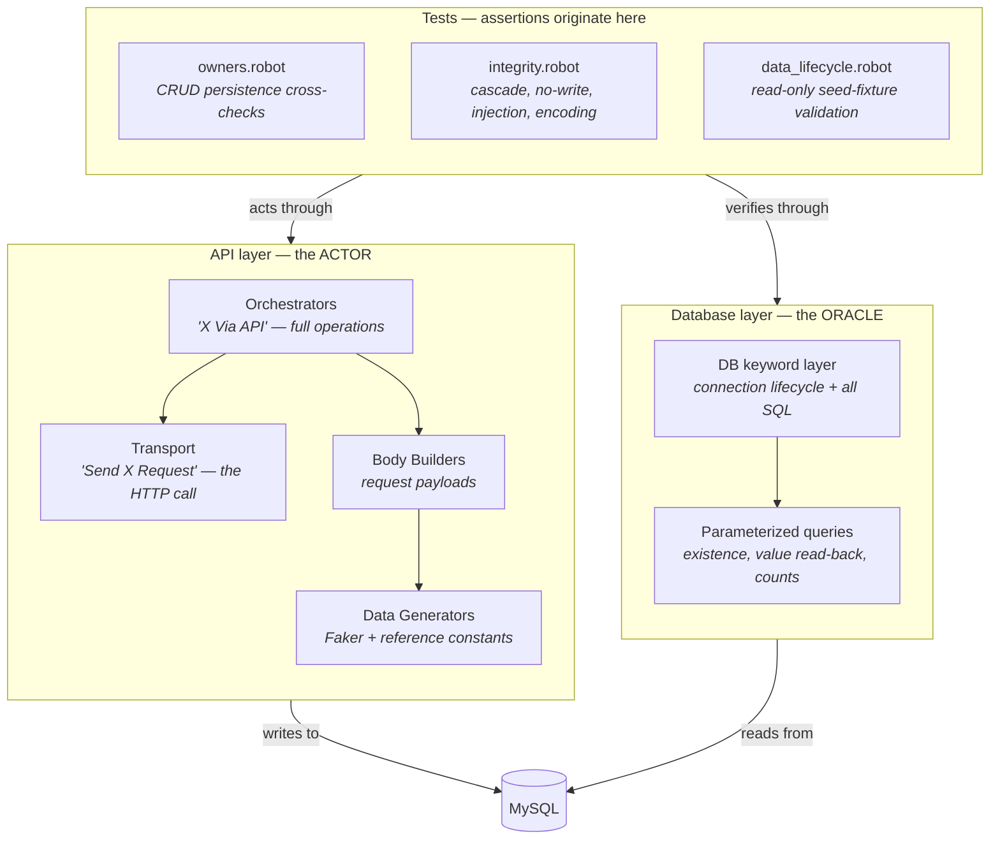
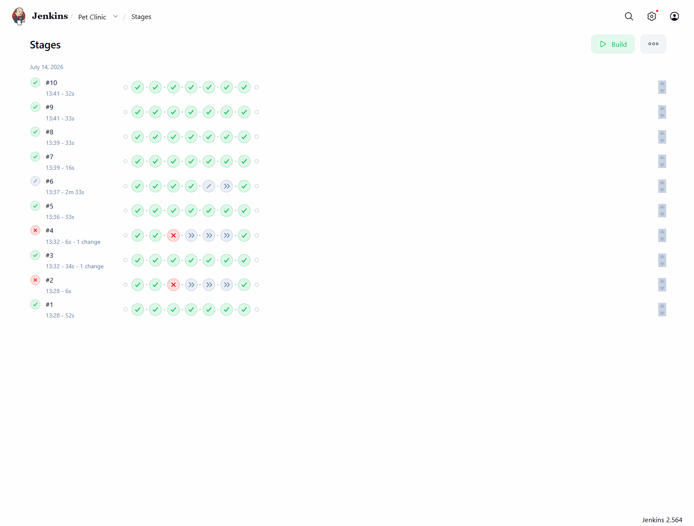
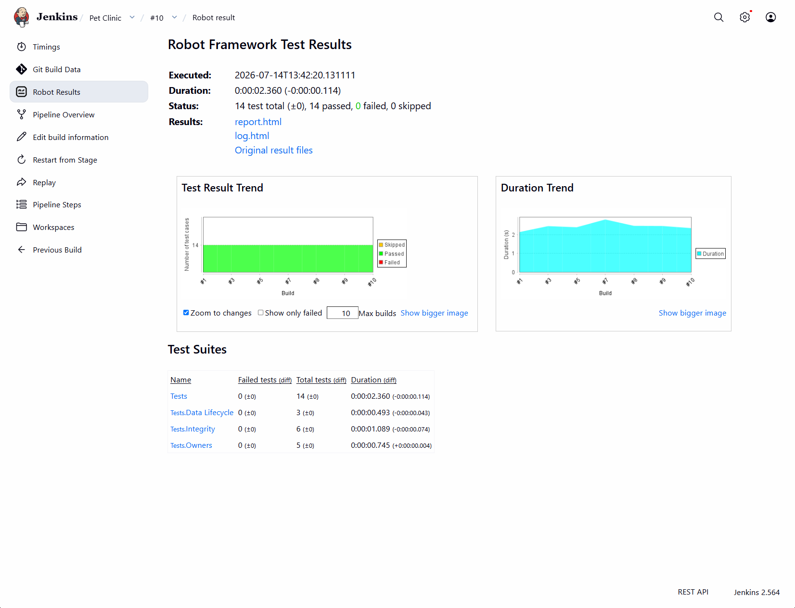

# Spring PetClinic — API × Database Validation Suite

**API × Database** test automation for the [Spring PetClinic REST](https://github.com/spring-petclinic/spring-petclinic-rest) service, built with Robot Framework. The API is driven as the **actor**; a **MySQL database is queried directly as the independent oracle** — a `201` is only a claim, the row is the proof. Strict layered architecture, a fully Dockerized app + database test bed, dual CI (Jenkins + GitHub Actions), and a published Allure report.

[](https://github.com/TahaFaisal00/petclinic/actions/workflows/ci.yml)
[](https://tahafaisal00.github.io/petclinic/)


**Live report:** an interactive [Allure test report](https://tahafaisal00.github.io/petclinic/) is published to GitHub Pages — open it to browse the full run with no setup.

---

## Overview

This suite validates the Spring PetClinic REST service not by trusting its responses, but by verifying what actually persists in its **MySQL database**. Every write is driven through the API and then confirmed — or refuted — by reading the underlying rows directly. It covers positive persistence flows, negative "no-write" flows, referential-integrity checks, and data-quality validation of the seed fixtures.

The repo is built around two ideas beyond raw coverage:

- **The database is the oracle.** The API is the *actor* that performs an operation; the database is the *independent source of truth* that confirms the effect. A response can lie — return `201` while persisting nothing, or persist to the wrong column — so the suite never verifies a write through the same channel that made it. After each API call, it queries MySQL and asserts on the real row: existence, and the exact field value.

- **The suite owns its entire environment.** Unlike testing a public site, the app *and* its database run locally via Docker Compose, seeded to a known state on every start. This makes the DB queryable, the data deterministic, and — critically — lets the full suite run **green end-to-end in CI** against a real application and a real database, with no external dependencies.

---

## Tech stack

| Concern               | Tool                              |
| --------------------- | --------------------------------- |
| Test framework        | Robot Framework 7.4               |
| Language runtime      | Python 3.12                       |
| API automation        | RequestsLibrary                   |
| Database automation   | DatabaseLibrary (PyMySQL driver)  |
| Application under test| Spring PetClinic REST             |
| Database              | MySQL 8.4                         |
| Environment           | Docker Compose (app + MySQL)      |
| Test data generation  | FakerLibrary                      |
| Built-ins             | Collections, String, DateTime     |
| Reporting             | Allure                            |
| CI/CD                 | Jenkins · GitHub Actions          |

---

## Architecture

The suite has no Page Object layer — a database has no DOM, so there are no locators to encapsulate. Instead, all SQL is centralized in a dedicated database layer, mirroring the role a Page Object plays for a UI: one file owns the schema knowledge, so a schema change touches exactly one place.



**The rules that hold the suite together:**

- **The actor / oracle split.** The API performs the operation; the database confirms it. A write is never verified through the interface that made it — an independent channel catches bugs (e.g. a wrong ORM field mapping) that a same-channel round-trip would hide.
- **All SQL lives in the database layer.** No test contains raw SQL. If the schema changes, exactly one file changes — the same "single source of truth" rule a Page Object enforces for locators.
- **Queries are always parameterized** (`%s` placeholders + bound values), never string-built — injection-safe by construction.
- **Existence before extraction.** A row's existence is asserted before any column value is read from it, so a missing row fails with a clear message instead of an index error.
- **`VAR scope=TEST`** carries generated data and captured IDs (`&{OWNER_DETAILS}`, `${NEW_OWNER_ID}`, `${PET_ID}`) from API setup to the DB assertions and teardown within a test.
- **Resilient teardowns** — cleanup runs under `Run Keyword And Ignore Error`, child-before-parent, so a half-failed test can't strand rows or cascade into a teardown failure.

---

## Project structure

```
petclinic/
├── docker-compose.yml            # App + MySQL, healthcheck-gated, reseeds each run
├── Dockerfile                    # Containerized test runner
├── requirements.txt              # Pinned dependencies
├── Resources/
│   ├── TestData.robot            # Business values, reference constants, DB config
│   ├── API_RES.robot             # API orchestration / transport / body builders
│   └── db_keywords.resource      # Connection lifecycle + all SQL (the oracle)
└── Tests/
    ├── owners.robot              # CRUD persistence cross-checks (create/update/delete/pet/visit)
    ├── integrity.robot           # Cascade, no-write, SQL-injection, UTF-8 encoding
    └── data_lifecycle.robot      # Read-only seed-fixture data-quality checks
```

---

## Test coverage

**Persistence cross-checks — `Tests/owners.robot`**
Each write is driven via the API, then verified against the database: create an owner and assert the row exists with correct field values; update a field and assert the *changed* value persisted (the `PUT` returns `204` with no body — the DB is the only way to confirm the change); delete and assert the row is gone; create a pet and a visit and assert each child row links to the correct parent by foreign key. Every existence check is validated to *fail when absent*, so a green result is trustworthy.

**Integrity & negative tests — `Tests/integrity.robot`**
- **Cascade behavior** — deleting a pet correctly cascades to its visits (verified: no orphaned visit rows remain).
- **No-write on rejection** — an invalid or incomplete request must return `4xx` *and* leave the database unchanged (asserted both by row-count delta and by searching for the rejected value).
- **SQL-injection resistance** — a `' OR '1'='1` payload on the owner search is treated as literal data: no data leak, no `500`, identical to any other non-matching search (CWE-89).
- **Character-encoding integrity** — a non-Latin (Arabic) name round-trips through the API and is read back byte-for-byte from the `utf8mb4` column, proving correct Unicode persistence.

**Data-quality — `Tests/data_lifecycle.robot`** (read-only, no mutations):
- **Referential integrity** — every foreign key in the schema resolves: no orphaned pets, pet-types, or visits, and no dangling references on either side of the `vet_specialties` junction table.
- **Seed baseline** — record counts and specific expected content match the known fixture state, guarding against silent data loss, duplication, or corruption.
- **Uniqueness** — fields that must be functionally unique (owner telephones, specialty names) contain no duplicates.

---

## A real finding — inconsistent cascade behavior

Driving deletes through the API surfaced a genuine referential-integrity inconsistency in the application:

| Operation | Behavior |
| --------- | -------- |
| Delete a **pet** that has a **visit** | `204` — the visit cascades away cleanly, no orphan |
| Delete an **owner** that has a **pet** | `404 DataIntegrityViolationException` — nothing is deleted |

The same parent-child delete is handled two different ways at two levels of the same hierarchy, and the owner-level case surfaces a raw persistence exception to the client. Both behaviors are captured as **passing tests asserting the actual behavior** — keeping CI green while pinning the defect — with the discrepancy written up in [BUGS.md](BUGS.md). If the application is ever fixed, those tests fail loudly and announce the change.

**The rule:** the suite documents known-defective behavior rather than forcing it green; a real bug becomes a permanent, self-announcing record, not a source of false failures.

---

## Running with Docker

The environment is defined entirely in `docker-compose.yml` — the PetClinic app and a MySQL 8.4 database, wired together, with the app healthcheck-gated on the database. Because no named volume is attached, **every start reseeds the database to a known state**, giving the suite a deterministic fixture set on every run.

```bash
# 1. Stand up the app + database (blocks until both are healthy)
docker compose up -d --wait

# 2. Run the full suite against the live stack
robot Tests/

# 3. Tear the environment down (discards the database — a clean reset)
docker compose down
```

The suite also ships a `Dockerfile` that packages the test runner itself into a reproducible image, defaulting `DB_HOST` to the `mysql` service name for in-network execution.

**Notes:**

- The app self-initializes its MySQL schema and seed data on startup — no init scripts to mount.
- `docker compose up -d --wait` blocks until the MySQL healthcheck passes, so tests never start before the database is ready.
- Because there is no persistent volume, `docker compose down && docker compose up` is a full reset to the seed state — the same mechanism used to guarantee a clean fixture between runs.

---

## CI/CD

**GitHub Actions** (`.github/workflows/ci.yml`) stands up the full stack and runs the suite on every push. Because the app and database are containerized in the pipeline itself, the run is **fully green end-to-end** — a real application and a real MySQL database, no external dependencies and no dry run.

**Jenkins** runs the same suite in a declarative pipeline (`Jenkinsfile`): checkout → `docker compose up` the app + database → build isolated virtual environment → execute → Robot Framework result publishing → `docker compose down`. Concurrent builds are disabled to prevent host-port contention on the database.

**Pipeline stages**



**Latest run — Robot Framework results, with trend and per-suite breakdown**



```bash
# 1. Install dependencies (into a virtual environment)
pip install -r requirements.txt

# 2. Stand up the environment, then run everything
docker compose up -d --wait
robot Tests/

# 3. Run a single area
robot Tests/owners.robot
robot Tests/integrity.robot
robot Tests/data_lifecycle.robot

# 4. Generate the Allure report locally
robot --listener allure_robotframework:allure-results Tests/
allure serve allure-results
```

Results are written to `log/output.xml`, `log/log.html`, and `log/report.html`.

---

## License

For demonstration and portfolio purposes.
